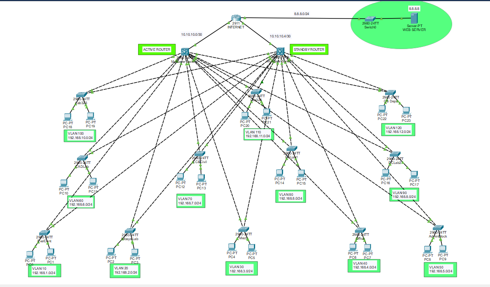

# Network-Simulation
- This project is developed using Cisco Packet Tracer. 
- This is a networking project. 
- The project involves designing a network topology and configure the network devices to test the network traffic in a virtual environment. 
- The network design of the project addresses the issues in the current network infrastructure of the college.
- Using the simulation feature of 

## Network topology
This is the network design of the project:

## Networking Technologies
The main technologies used in this project are as follows:

- VLAN
- Inter-VLAN Routing
- DHCP Server
- QoS
- HSRP

## Devices
The main devices used in the network design are as follows:

### Core Devices
- Routers
- Switches

### End Devices
- PCs
- Printers
- Servers
